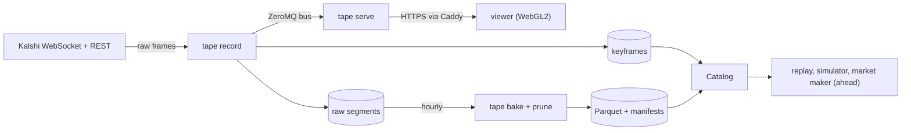

# Kalshi Tape

[](https://github.com/ericsohel/KalshiTradingProject/actions/workflows/ci.yml)

An order-book flight recorder, deterministic replay engine, and self-calibrating
market maker for [Kalshi](https://kalshi.com), with a live WebGL viewer.

> Live: <https://kalshi-tape-live.northcentralus.cloudapp.azure.com>
>
> Status: recording around the clock on an Azure VM. The exchange client, the recorder,
> its live event bus, the live API (`tape serve`), the live viewer, and the hourly bake to
> Parquet with verified pruning and a catalog are built and tested; the replay viewer, the
> simulator, and the market maker are still ahead. The design documents in `docs/` remain
> the contract the code is built against.

## What this is

Kalshi keeps about three months of live data and exposes no historical order-book
depth. This project records every order-book change in the markets it follows into a
replayable *tape*, rebuilds any market's book at any instant, and uses that data for
three things:

1. **A live viewer** (running). A Bookmap-style liquidity heatmap of any recorded market,
   with trades, a depth ladder, and a market picker, streamed live to a public web page.
   Scrubbing recorded history like a video arrives with the replay viewer.
2. **An honest simulator** (ahead). A Kalshi-exact exchange simulator whose fill model is
   calibrated against real one-cent orders, so backtests report error bars instead of a
   single flattering number.
3. **A market maker** (ahead). A log-odds quoting strategy that runs on the same
   event-sourced engine in replay, shadow, and live modes, and whose P&L is reconciled to
   the cent against the exchange's own records.

The recorded tape stays private (Kalshi's data terms). The code, methodology,
integrity metrics, and aggregated results are public.

## How it works



Python 3.12 with asyncio, msgspec, ZeroMQ, Starlette, and pyarrow; TypeScript, React, and
WebGL2; Caddy and systemd on Azure.

- **Recorder** (`tape record`). RSA-PSS-signed REST and WebSocket sessions with a
  client-side mirror of Kalshi's token-bucket rate limits. Every inbound frame is appended,
  unparsed and timestamped, to an append-only zstd segment before any parser runs
  (ADR 0001). Books are kept in YES space with integer fixed-point prices and counts,
  keyframed every five minutes, and audited against REST snapshots: an audit passes when
  the snapshot matches some local book state inside its request window (ADR 0021). A
  sequence gap re-snapshots only its own connection. Production records 200 markets.
- **Live bus.** Decoded events go out on a ZeroMQ `ipc://` socket as numbered messages,
  with a periodic image of every book, so a consumer that dropped messages or started late
  recovers on its own; the recorder never waits for a consumer (ADR 0008, ADR 0022).
- **Live API** (`tape serve`). Starlette on msgspec: REST routes for markets and status,
  and a WebSocket feed of snapshots, deltas, trades, and tickers. Its message schema
  generates the viewer's TypeScript types, and CI fails on drift (ADR 0023).
- **Viewer** (`web/`). React for the page and a framework-free WebGL2 renderer for the
  depth heatmap and trade bubbles. Caddy serves it and the API from the recording host
  (ADR 0024).
- **Bake, prune, and catalog** (`tape bake`, `tape prune`). An hourly timer turns each
  closed hour of raw segments into Parquet tables and the day's manifest of row counts and
  hashes. Raw hours are deleted only after a verified bake and a 72-hour window
  (ADR 0025). The catalog rebuilds a book at any instant from the latest keyframe and the
  baked changes after it (ADR 0026).

## Measured

| What | Result |
|---|---|
| Tests | 771 Python tests at 96% branch coverage and 197 viewer tests; CI also gates ruff, mypy strict, the layer and no-float rules, and API schema drift |
| Bake | 49 hours of the development tape (2,000 markets, 2026-09-10 to 09-12): 5.81 GiB and 220 million records into 1.99 GiB of Parquet at 7.6 MiB/s on one core, with no decode failure, corrupt segment, or gap |
| Book rebuilds | 317,217 of 317,389 books rebuilt from a keyframe and baked changes equal the next keyframe (99.95%); every miss had a change within 100 ms of the keyframe instant |
| Audits | 32,472 of 32,710 REST snapshot audits passed over the same three days (99.3%) |

Method and details: [OPERATIONS 5.1](docs/OPERATIONS.md#51-baking-the-recorded-archive).

## Running it

You need Python 3.12 with [uv](https://docs.astral.sh/uv/) and Node 24. Recording needs a
Kalshi account and a read-scoped API key; the viewer's mock API needs neither. Run each
long-running command in its own terminal.

The viewer against a synthetic feed:

```bash
npm --prefix web ci
npm --prefix web run mock                                  # stand-in API on :8787
TAPE_API=http://127.0.0.1:8787 npm --prefix web run dev    # http://localhost:5173
```

Recording, serving, and baking:

```bash
uv sync
cp config/tape.example.toml tape.toml          # set key_id and private_key_path
uv run tape config check --config tape.toml
uv run tape record --config tape.toml          # until Ctrl-C
uv run tape serve --config tape.toml           # needs recorder.bus_endpoint set
uv run tape bake --config tape.toml            # every closed hour that needs it
uv run tape prune --config tape.toml           # report only; --apply deletes
```

[OPERATIONS 4.3](docs/OPERATIONS.md#43-watching-live-data-locally) connects the viewer to a
real recorder, and [deploy/](deploy/README.md) holds the production host's units and
Caddyfile. Tests and the viewer's full check:

```bash
uv run pytest --cov
npm --prefix web run check
```

## Documents

| Document | Purpose |
|---|---|
| [docs/PROPOSAL.md](docs/PROPOSAL.md) | Why this project, the research behind it, and the decisions taken so far |
| [docs/ARCHITECTURE.md](docs/ARCHITECTURE.md) | System context, processes, data flow, deployment, failure modes |
| [docs/DATA_FORMATS.md](docs/DATA_FORMATS.md) | Kalshi wire formats, the tape segment format, Parquet tables, manifests |
| [docs/INTERFACES.md](docs/INTERFACES.md) | Module boundaries, protocols, types, error hierarchy, configuration |
| [docs/FRONTEND.md](docs/FRONTEND.md) | The live viewer: views, API contract, rendering, hosting |
| [docs/ENGINEERING_STANDARDS.md](docs/ENGINEERING_STANDARDS.md) | Code quality rules that every change must satisfy |
| [docs/TESTING.md](docs/TESTING.md) | Test strategy from property tests to production integrity metrics |
| [docs/OPERATIONS.md](docs/OPERATIONS.md) | Deployment, secrets, monitoring, storage, runbook |
| [docs/ROADMAP.md](docs/ROADMAP.md) | Milestones with definitions of done |
| [docs/GLOSSARY.md](docs/GLOSSARY.md) | Kalshi and project vocabulary |
| [docs/adr/](docs/adr/) | Architecture decision records |
| [specs/](specs/) | Kalshi's OpenAPI and AsyncAPI specs, pinned; a weekly workflow reports upstream changes |

## Principles

1. Record first, interpret later. Raw bytes hit disk before any parser runs.
2. Exact arithmetic. Prices, counts, and dollars are integers in fixed units; floats never touch money.
3. Determinism. Replaying a day reproduces the same decisions, proven by hash.
4. Every claim is measured. Uptime, gap share, and book mismatch rate are published daily.
5. The recorder is sacred. Nothing else in the system may endanger it.
6. Exchange semantics are modeled, not approximated.

## Layout

```
src/tape/          Python package
  client/          request signing, rate-limit mirror, REST and WebSocket sessions
  wire/            msgspec structs for Kalshi's payloads
  book/            YES-space order book
  segment/         raw tape segments and keyframes
  recorder/        universe, subscription planning, capture, gaps, audits
  bus/             sequenced ZeroMQ publisher and subscriber
  api/             tape serve: REST routes and the live WebSocket
  bake/            raw hours to Parquet, manifests, pruning
  store/           catalog over keyframes, baked tables, and manifests
web/               TypeScript + React + WebGL2 viewer, with a mock API for development
tests/             unit, property, contract, and live-endpoint tests
specs/             pinned Kalshi OpenAPI and AsyncAPI specs
scripts/           layer, no-float, and API schema checks
config/            example configuration
deploy/            systemd units, Caddyfile, and server config for the Azure host (ADR 0024)
docs/              design documents and ADRs
```

## License

MIT. See [LICENSE](LICENSE).
